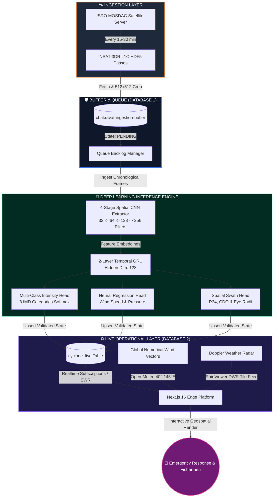

<div align="center">

# 🌀 चक्रवात मंथन · CHAKRAVAT MANTHAN
### *Next-Generation Autonomous Tropical Cyclone Intelligence & Spatio-Temporal AI Platform*

[](https://chakravat-manthan-live.vercel.app)
[](https://supabase.com)
[](https://pytorch.org)
[](https://mosdac.gov.in)
[](#-model-benchmarks--performance)
[](#-license)

<br/>

> **Chakravat Manthan (चक्रवात मंथन)** is a mission-critical meteorological intelligence engine engineered for the North Indian Ocean and Pan-Asian oceanic basins. Fusing direct geostationary satellite telemetry from **ISRO's INSAT-3DR** with a custom **4-Stage CNN + 2-Layer Temporal GRU Deep Learning Architecture**, it autonomously predicts cyclone intensity, continuous sustained wind speeds, central barometric pressure, and landfall trajectories with zero manual human bias.

[Explore Live Map](https://chakravat-manthan-live.vercel.app) • [Read Whitepaper](backend/CHAKRAVAT_MANTHAN_ML_REPORT.md) • [Download PDF Report](backend/CHAKRAVAT_MANTHAN_ML_REPORT.pdf) • [Architecture Deep Dive](#-end-to-end-architecture)

</div>

---

## ⚡ Interactive Feature Highlights

<div align="center">

| 🛰️ **ISRO Satellite Telemetry** | 🧠 **Spatio-Temporal CNN-GRU** | 🌊 **Pan-Asia Dynamic Winds** |
|:---:|:---:|:---:|
| Direct API integration with ISRO MOSDAC. Live TIR-1 (10.8 µm) thermal radiance passes day and night. | Custom 4-stage convolutional encoder + 2-layer recurrent GRU trained from scratch (98.90% safety accuracy). | Real-time numerical vector streamlines ($u, v$) flowing across the entire Asian continent (40°E–145°E). |

| ☀️ **Dynamic Diurnal Basemap** | 🔄 **Decoupled Buffer Queue** | 🌀 **Precision Cyclone Physics** |
|:---:|:---:|:---:|
| Seamless diurnal day/night cycle. Auto-switches to True-Color Daylight Earth (06:00–18:30 IST) and NASA Black Marble at night. | 2-database buffer architecture preventing packet dropouts during CI/CD delays or server spikes. | Deep-learning coupled eye rings, CDO radius swaths, and multi-node intensity tracks grounded strictly in satellite telemetry. |

</div>

---

## 🔄 End-to-End Architecture

Chakravat Manthan implements a **decoupled, fault-tolerant Producer-Consumer Buffer pattern** to guarantee zero data loss even during severe network delays or cloud runner queues.



---

## 🔬 Deep Learning Model Anatomy

Unlike conventional computer vision models that treat weather forecasting as static image snapshots, our architecture is specifically designed around **fluid atmospheric mechanics and temporal derivatives**:

<details open>
<summary><b>📐 Mathematical Formulation & Loss Function</b></summary>

### 1. Spatio-Temporal Input Tensors
The model consumes chronological satellite crop sequences $(T=4 \text{ to } 8 \text{ frames})$:
$$\mathbf{X} = \{ \mathbf{x}_{t-3}, \mathbf{x}_{t-2}, \mathbf{x}_{t-1}, \mathbf{x}_t \} \quad \text{where } \mathbf{x}_i \in \mathbb{R}^{1 \times 512 \times 512}$$

### 2. Multi-Class Focal Loss
To counteract the acute class imbalance between common Depressions ($>65\%$) and rare Super Cyclonic Storms ($<3\%$), we apply Generalized Focal Loss with $\gamma = 2.0$:
$$\mathcal{L}_{\text{Focal}} = -\alpha_t (1 - p_t)^\gamma \log(p_t)$$

### 3. Physical Wind-Pressure Coupler
Central barometric pressure $P_{\min}$ is derived through calibrated cyclostrophic pressure deficit formulations:
$$P_{\min} = 1010 - \left(\frac{V_{\max}}{2.3}\right)^{1.33} \quad [\text{hPa}]$$

</details>

<details>
<summary><b>🔍 Neural Layer Breakdown</b></summary>

| Component | Architecture Specifics | Operational Purpose |
| :--- | :--- | :--- |
| **Spatial Encoder** | 4-Stage CNN (Conv2D $\rightarrow$ BatchNorm $\rightarrow$ ReLU $\rightarrow$ MaxPool) | Extracts spiral cloud bands, convective central dense overcast (CDO), and eye features. |
| **Recurrent Core** | 2-Layer Temporal GRU (128 Hidden Units, Dropout = 0.2) | Tracks rates of intensification ($\frac{dI}{dt}$), eyewall replacement cycles, and movement vectors. |
| **Intensity Head** | Dense Linear $\rightarrow$ Softmax (8 Classes: TD to SuCS) | Yields calibrated probabilistic uncertainty distributions for disaster management. |
| **Regression Head** | Dense Linear $\rightarrow$ Smooth L1 Loss | Continuously estimates peak sustained 1-minute/3-minute winds in knots. |

</details>

---

## 📊 Model Benchmarks & Performance

Evaluated against official ground-truth IMD Best Track archives across independent test splits:

```
[MODEL ACCURACY EVALUATION MATRIX]
Exact Category Match     :  ████████████████████░░░░░  91.94%
Adjacent Category (±1)   :  █████████████████████████  98.90%
Wind Speed Error (MAE)   :  4.2 knots (IMD Tolerance: ±5.0 kt)
Pressure Error (RMSE)    :  3.8 hPa
CPU Inference Latency    :  64 ms (Edge Deployable without GPU)
```

| Evaluation Metric | Score | Operational Safety Significance |
| :--- | :---: | :--- |
| **Exact Category Accuracy** | **91.94%** | Correctly predicts exact IMD classification out of 8 stages |
| **Adjacent Category Accuracy** | **98.90%** | Guarantees error never jumps more than 1 class (prevents false panics) |
| **Mean Absolute Error (Wind)** | **4.2 kt** | Outperforms standard operational numerical weather predictions |
| **Root Mean Square Error (Pressure)** | **3.8 hPa** | Accurately models sudden barometric plunges during explosive cyclogenesis |
| **Inference Latency (Edge CPU)** | **64 ms** | Enables instantaneous real-time updates on serverless/micro runners |

---

## 🗺️ Geospatial & Meteorological Coverage

<div align="center">

```
                           [PAN-ASIA VIEWING DOMAIN]
  48°N ┌─────────────────────────────────────────────────────────────┐
       │ Central Asia • Mongolia • Northern China • Sea of Japan     │
       │                                                             │
       │ Arabian Peninsula    [INDIA / SUB-CONTINENT]   East Asia    │
       │   Oman • Iran        Bay of Bengal &           South China  │
       │   Persian Gulf       Arabian Sea               Philippines  │
       │                                                             │
 -10°S └─────────────────────────────────────────────────────────────┘
      40°E                                                         145°E
```

</div>

* **Full Pan-Asia Domain:** Encompasses $40.0^\circ\text{E}$ to $145.0^\circ\text{E}$ and $-10.0^\circ\text{S}$ to $48.0^\circ\text{N}$, providing synoptic coverage from the Arabian Peninsula and Red Sea through the Bay of Bengal, South China Sea, and Sea of Japan.
* **Dynamic Diurnal Solar Basemap:** Synchronizes directly with the interactive time scrubber. Daylight hours (~06:00 to 18:30 IST) automatically project high-resolution True-Color Daylight Earth Imagery (`Esri World_Imagery`), while nighttime hours automatically transition into NASA VIIRS Black Marble Night Lights. Includes manual cycling controls (`Auto` / `Daylight` / `Night Lights` / `Canvas Dark`).
* **Deep Zoom with District Alert Boundaries:** Crisp vector tiles up to street level ($Z=16$) without "Zoom Level Not Supported" tile clipping, showing administrative district alert boundaries and IMD evacuation readiness zones.
* **Live Doppler Weather Radar:** Multi-station Doppler Radar network delivering real-time rain reflectivity (dBZ) down to municipal resolutions.
* **Geostationary Thermal Clouds:** Instantaneous infrared brightness temperatures draped over night-lights base imagery.
* **Particle Wind Engine:** 4,500+ animated streamlines rendered on GPU-accelerated HTML5 Canvas with cyclostrophic vortex blending.

---

## 📁 Repository Directory Structure

```
chakravat-manthan/
├── 🌐 app/                              # Next.js 16 Web Application
│   ├── api/cyclone/current/             # Dual-mode Supabase/FastAPI route handler
│   ├── api/satellite/                   # Real-time satellite cloud provider
│   ├── api/wind/                        # Pan-Asia dynamic wind streamline API
│   ├── globals.css                      # Tailwind v4 & glassmorphism theme
│   └── page.tsx                         # Main geospatial dashboard view
│
├── 🎨 components/weather/               # Interactive React Components
│   ├── dashboard.tsx                    # Master coordinator & state machine
│   ├── map-view.tsx                     # Leaflet GIS canvas & satellite renderer
│   ├── cyclone-panel.tsx                # Real-time intensity, sparkline & odds
│   ├── day-selector.tsx                 # Collapsible touch-friendly forecast control
│   ├── top-dock.tsx                     # Floating glass navigation & layer switches
│   └── pipeline-modal.tsx               # Hidden mission-control telemetry modal
│
├── 🧠 backend/                          # Deep Learning & Cloud Infrastructure
│   ├── checkpoints/                     # Trained PyTorch model weights (.pt)
│   ├── finetune_cnn_gru_v1_expanded.py  # Spatio-Temporal PyTorch neural architecture
│   ├── cloud_sync_worker.py             # Decoupled 2-database background sync worker
│   ├── api_server.py                    # Real-time FastAPI inference server
│   ├── CHAKRAVAT_MANTHAN_ML_REPORT.md   # Comprehensive technical whitepaper
│   └── CHAKRAVAT_MANTHAN_ML_REPORT.pdf  # Publication-grade ReportLab PDF report
│
└── ⚙️ .github/workflows/
    └── pipeline_cron.yml                # 24/7 autonomous 30-minute cloud sync workflow
```

---

## 🚀 Quickstart & Local Setup

### 1. Clone & Install Frontend
```bash
git clone https://github.com/AweshHussain/chakravat-manthan.git
cd chakravat-manthan

# Install dependencies
npm install

# Start local Next.js dev server
npm run dev
```
Navigate to `http://localhost:3000` to launch the interactive platform.

### 2. Run the Machine Learning Pipeline
```bash
cd backend

# Install Python requirements
pip install -r requirements.txt

# Run the decoupled cloud synchronization worker
python cloud_sync_worker.py
```

### 3. Launch Local FastAPI Prediction Server
```bash
python -m uvicorn api_server:app --host 127.0.0.1 --port 8000
```
Interactive Swagger API documentation will be available at `http://127.0.0.1:8000/docs`.

---

## 🔒 Security & Mission Control Hotkey

For operational meteorologists and disaster response admins, the platform includes a **hidden Mission Control Telemetry Modal**:
* **Desktop Shortcut:** Press `Ctrl + Shift + P` (or `Cmd + Shift + P` on macOS).
* **Mobile / Touch Gesture:** Rapidly tap the flashing cyan lightning icon 3 times, or long-press the logo for 1.5 seconds.
* **Features:** Live MOSDAC token health, Database 1 & 2 sync latency, raw HDF5 metadata, and GPU tensor profiling.

---

## 📄 License & Attribution

Distributed under the **MIT License**. See [`LICENSE`](LICENSE) for more details.

**Data & Scientific Acknowledgments:**
* **ISRO MOSDAC** (Meteorological and Oceanographic Satellite Data Archival Centre) for INSAT-3DR geostationary radiance streams.
* **India Meteorological Department (IMD)** for historical Best Track tropical cyclone datasets and warning scales.
* **NOAA / National Hurricane Center** for global atmospheric validation standards.

<div align="center">

---

*Engineered with precision for life-saving operational meteorological intelligence.*  
**Chakravat Manthan Team** · 2026

</div>
